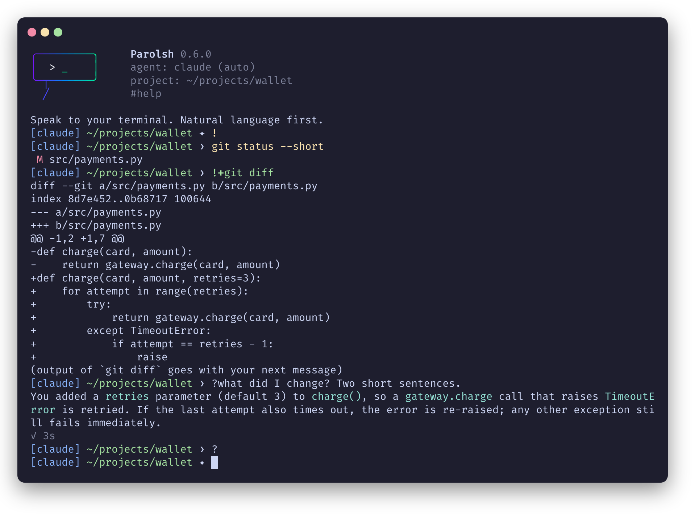

# Input routing

Parolsh never guesses whether a line is English or a shell command. The first
character decides, always:

| Input | Route |
|---|---|
| `text` | The active ACP agent |
| `?text` | The active ACP agent |
| `/command` | The active ACP agent, unchanged |
| `!command` | The configured shell, default `bash -ic` |
| `!+command` | The same, and its output goes with your next message |
| `!bash` | An interactive Bash session |
| `#command` | Parolsh itself |
| `!` alone | Lock: plain text goes to the shell, see [Shell mode](#shell-mode) |
| `?` alone | Unlock: plain text goes to the agent again |

`find files modified today` is always a question for the agent. To run the
Unix `find`, type `!find . -mtime -1`.

## Shell mode

When you run many commands in a row, `!` alone locks plain text to the
shell, and `?` alone unlocks it. The prompt's last symbol shows where plain
text goes:

```text
[claude] ~/projects/wallet ✦ !
[claude] ~/projects/wallet ❯ git status             ← bash
[claude] ~/projects/wallet ❯ ?why is main behind?   ← the agent
[claude] ~/projects/wallet ❯ ?
[claude] ~/projects/wallet ✦ what changed today?    ← the agent
```

A real session, locked to bash, sharing a diff with the agent, then
unlocked:



| Input | Agent mode `✦` (default) | Shell mode `❯` |
|---|---|---|
| `text` | the agent | the shell, like `!text` |
| `?text` | the agent | the agent |
| `/command` | the agent | the shell (`/usr/bin/ls` runs); `?/command` reaches the agent |
| `!command`, `!+command`, `!bash` | the shell | the same |
| `#command` | Parolsh | Parolsh |

Unlike `!bash`, shell mode stays in Parolsh: the agent is a `?` away, `!+`
shares output with it, and `#` commands work. Each command runs in its own
shell, but a `cd` and the variables you export carry over to the next (see
[`!command`](#command)). The mode lasts until you change it or leave Parolsh.

To start in shell mode, set `input = "shell"` in `config.toml` (see
[Configuration](configuration.md#keys)), or run `parolsh --input=shell`;
`--input` wins over the file. A project's `.parolsh/config.toml` can set it
too: `#cd` into a project whose `input` differs switches to it. Without an
agent configured, Parolsh always starts in shell mode.

## While you type

On an ANSI terminal the line shows where it will go before you press Enter:

| Line | Color |
|---|---|
| `!command`, `!bash` | yellow |
| `!+command` | green |
| `#command` | magenta |
| `/command` | blue |
| text for the agent | the terminal's color |

In shell mode, plain text is a shell command, so it is yellow too. The marker
(`!`, `!+`, `#`, `/`) is bold. While the line is only a marker, a
dim hint says what it does, for example `!+  run a shell command and send its
output with your next message`. The hint is a tip: the right arrow does not
insert it into the line.

### Tab completion

On `!command` and `!+command` lines, and plain lines in shell mode, `Tab`
completes the word at the cursor,
as bash does: a single match goes into the line, several fill in what they
have in common, and the next `Tab` shows them in a menu (`Tab` and
`Shift+Tab` move through it, `Enter` picks one).

- **The command name** completes from the programs on your `PATH` and, when
  the shell is bash, from the aliases, functions and builtins your
  `~/.bashrc` sets up. That list is read once, in the background, when
  Parolsh starts: an alias added later shows up the next time.
- **A command's arguments** complete as bash would, when the shell is bash
  and [bash-completion](https://github.com/scop/bash-completion) is
  installed: git branches and subcommands, ssh hosts, systemctl units,
  `--flags`. It uses the completions bash-completion ships, those in
  `~/.local/share/bash-completion/completions/` and `~/.bash_completion`,
  but not the ones your `~/.bashrc` defines (`complete -C ...`,
  `source <(kubectl completion bash)`): put those in `~/.bash_completion`
  to get them. `!bash` has your full bash completion.
- **Other words**, and arguments bash-completion has nothing for (or takes
  more than half a second to find), complete as file and directory names,
  from the directory your commands run in. `~/` and absolute paths work, hidden
  files show up when the name starts with `.`, and special characters are
  escaped (`My\ Files`).

On `#` lines, `Tab` completes the command's name (`#a` gives `#agent` and
`#audit`), and after `#cd` a directory, from the directory your commands run
in. `#cd` takes the path as typed, so names with spaces are not escaped there
(`#cd My Projects/`). Other `#` commands have no arguments to complete.

In text for the agent (`?text` in shell mode), `Tab` completes `@path` with a
file or directory name from the agent's directory, escaped like on a shell
line (`@My\ Notes.md`); see [Mentioning files](#mentioning-files). Other
words of the text have no completion.

## `!command`

The command runs as `bash -ic "<command>"`, in the directory the last
command ended in.

- **Your `~/.bashrc` is loaded**, so aliases, functions and shell options work
  as in your normal terminal. The shell is interactive (`-i`) because a plain
  `bash -c` ignores aliases, and the stock Debian/Ubuntu `~/.bashrc` stops
  right away when the shell is not interactive.
- **A `cd` carries over.** When a command ends, its shell tells Parolsh the
  directory it ended in, and the next command runs there: `cd src`,
  `cd -`, `pushd`, a `cd` before `exit 1`.
- **So do the variables you export.** `export FOO=1`, `unset FOO`,
  `source .envrc`, `nvm use 20`, `source venv/bin/activate`: what a command
  changed in its exported variables is applied again before the next one,
  after your startup files, so it wins over them as in a terminal (the
  virtualenv stays first in `PATH`). For each variable the last value replaces
  the one before.

  ```text
  [claude] ~/projects/wallet ❯ source venv/bin/activate
  [claude] ~/projects/wallet ❯ which python
  /home/joao/projects/wallet/venv/bin/python
  ```

  Only exported variables: a plain `FOO=1`, an alias or a function defined in
  a line is gone when it ends (so a virtualenv's `deactivate` is not there;
  `set -a; source .env; set +a` exports a file of plain `KEY=value` lines).
  `!bash` starts with these changes, and is a session that keeps all of its
  state. They are kept in memory until you leave Parolsh, and are not given to
  the agent: it keeps the environment it started with.
- **The agent stays where it is.** A `cd` moves your commands, not the
  conversation: the agent keeps working in the directory it started in, and
  the prompt shows both while they differ:

  ```text
  [claude] ~/projects/wallet ✦ !cd /var/log
  [claude ~/projects/wallet] /var/log ✦ #cd .       ← brings the agent here
  [claude] /var/log ✦
  ```

  `#cd .` starts a new conversation in the directory of your commands. The
  outputs you share with `!+` say where they ran.
- The directory comes back through the shell's `EXIT` trap, so the
  `shell` must understand `trap` (bash, zsh, dash do). A command that ends
  with `exec`, or is killed, leaves the directory as it was.
- **Commands stay out of your bash history.** Parolsh sets `HISTFILE=/dev/null`
  for them and keeps its own history.
- A non-zero exit code is printed after the output, for example `exit 1`.
- `Ctrl+C` stops the running command, not Parolsh.
- Parolsh has no job control for your commands (for the agent's turns, see
  [Turns in the background](agents.md#turns-in-the-background)). With the
  default `bash -ic`, `Ctrl+Z` is handled by that bash, as if you had typed the line in bash: the running program is
  paused (`Stopped`), the rest of the line continues, and the paused program
  ends when the command finishes. With a non-interactive `shell` such as
  `["bash", "-c"]`, Parolsh resumes the command right away. Use `!bash` when
  you need job control.

Loading `~/.bashrc` costs a little time on every command (about 0.17 s on a
typical Ubuntu setup). Anything `~/.bashrc` or `/etc/bash.bashrc` prints also
shows up in the output.

The shell is configurable, see [Configuration](configuration.md):

```toml
shell = ["zsh", "-ic"]
```

## `!+command`

Runs the command like `!command`, shows its output, and keeps it for the
agent: it is sent with your next message, then forgotten.

```text
[claude] ~/projects/wallet ✦ !+docker ps
CONTAINER ID   IMAGE        STATUS
...
(output of `docker ps` goes with your next message)
[claude] ~/projects/wallet ✦ which of these containers looks unhealthy?
```

The agent answers from that output instead of running the command again.

- Only commands you mark with `!+` are shared: a plain `!command` never
  reaches the agent.
- Several `!+` commands before one message are all sent, in order, each with
  its command, directory and exit code.
- At most the last 16 KB of each output is sent.
- The command's output goes through Parolsh, so programs see a pipe instead
  of a terminal: they print plain text, without colors or pagers. Full-screen
  programs (`vim`, `top`) belong to a plain `!`. Its input is still the
  terminal, so a `sudo` password prompt works.
- `!+` alone shows how to use it.

## `!bash`

Opens a real interactive Bash in the directory of your commands, with your full
`~/.bashrc` and completions. `exit` returns to Parolsh, in the directory it was
in before: changes made inside the session stay there.

## Text

Anything that does not start with `!`, `#` or `/` is a question for the
agent, in agent mode (in shell mode, start it with `?`). The answer is printed as it arrives, with a status line showing what
the agent is doing (see [During a turn](agents.md#during-a-turn)). `Ctrl+C`
cancels the turn.

### Mentioning files

`@path` names a file or directory for the agent:

```text
[claude] ~/projects/wallet ✦ why does @src/api/client.rs retry twice?
```

The text goes as typed, and each `@path` that exists goes with it as a link
(an ACP `resource_link` with the absolute `file://` path), which the agent
reads itself. Paths start at the agent's directory, even after a `cd` moved
your commands elsewhere; `~/` and absolute paths work. `@words` that name
nothing (`@team`, an email address) are only text, and punctuation right after
a path (`@notes.txt.`) is not part of it. `#audit` shows how many files a
message linked.

Not on `!` lines: there, `@` is the shell's.

## `/command`

Lines starting with `/` belong to the agent. Parolsh reserves no `/` commands
and forwards the line as typed, so the agent's own slash commands work.

## `#command`

| Command | What it does |
|---|---|
| `#help` | Show the input rules and commands |
| `#new` | Start a new conversation with the agent, in the agent's directory |
| `#new private` | Start a new conversation that is not saved in the [history](#the-history-of-sessions), until the next `#new`, `#cd` or `#agent` |
| `#cd <path>` | Change Parolsh's directory, for the agent and your commands, and start a new conversation there. `~` and relative paths work, from the directory of your commands, so `#cd .` brings the agent where a `cd` took them; no path means your home directory. Reloads the configuration of the project found there. An agent chosen with `#agent` stays when that project configures it; otherwise the project's `default_agent` is used, and the agent restarts if it changed. |
| `#agent` | Show the agent in use |
| `#agent list` | List configured agents; `*` marks the one in use |
| `#agent <name>` | Switch to another configured agent, with a new conversation. `default_agent` does not change. |
| `#options` | Show the running agent's options, `*` on the current values |
| `#options <id> <value>` | Set one of the agent's options until you leave Parolsh |
| `#config` | Show the configuration files in use, and whether they exist |
| `#config sample` | Print the full sample configuration |
| `#prompt` | Show the prompt style in use |
| `#prompt <name>` | Switch the prompt: `parolsh`, `starship` or `minimal`, until you leave Parolsh |
| `#project` | Show the project root |
| `#project init` | Create `.parolsh/` in the current directory |
| `#audit` | What happened since Parolsh started, see [`#audit`](#audit) |
| `#audit <n>` | What happened in session `n` of this project, from the [history](#the-history-of-sessions) |
| `#sessions` | The sessions of this project saved in the [history](#the-history-of-sessions), newest first; `*` marks the current one |
| `#forget [n]` | Remove session `n` from the history; the current one without `n` |
| `#resume <n>` | Go back to session `n` with its agent, in its directory: the agent remembers that conversation, and what follows is saved in it. Claude and Codex can; other agents say they cannot |
| `#redraw [n]` | Clear the terminal and show the last `n` exchanges of the conversation again (5 without `n`), see [Showing the conversation again](#showing-the-conversation-again). `Ctrl+L` does the same |
| `#jobs` | The agent's turns sent to the background with `Ctrl+Z`, see [Turns in the background](agents.md#turns-in-the-background) |
| `#fg [n]` | Wait for background turn `n`, or the last one. `Ctrl+C` cancels it, `Ctrl+Z` goes back to the prompt |
| `#exit` | Leave Parolsh (`Ctrl+D` also works). While a turn or a task of the agent runs in the background, the first one says so and stays: leaving stops them |

## `#audit`

`#audit` lists what happened since Parolsh started, oldest first: what ran on
your machine, what reached the agent, what the agent did, and what you
answered.

```text
[claude] ~/projects/wallet ✦ #audit
   0:12  USER     !kubectl get pods · exit 0
   0:20  USER     !+kubectl logs api · exit 0 · 12 KB kept
   0:31  SHARED   1 output(s), 12 KB → claude
   0:31  USER     → claude: why is the api crashing?
   0:44  AGENT    execute: kubectl describe pod api · completed
   0:52  AGENT    asks: Writing to src/foo.rs
   0:55  USER     → Allow once
   0:58  AGENT    edit: Write src/foo.rs [src/foo.rs] · completed
   1:03  PAROLSH  turn ended · 32s
```

| Who | What |
|---|---|
| `USER` | `!command`, `!+command` and `!bash` with their exit code, your messages (their first line) with the agent they went to, `#` commands, and your answers to the agent's questions |
| `SHARED` | `!+` output sent with a message, and its size |
| `AGENT` | Tool calls, with their kind, the files the agent names and how they ended; permission requests and questions |
| `PAROLSH` | How each turn ended, a cancel the agent did not confirm, an agent that stopped |

It keeps titles and commands only, the first line of each and at most 200
characters: outputs and answers stay in the scrollback. It is in memory, and
gone when you leave Parolsh; for a full record, see
[Logging the agent's messages](troubleshooting.md#logging-the-agents-messages).
It keeps the last 1000 entries and says how many older ones were dropped;
`audit_entries` in the [configuration](configuration.md#keys) changes that,
and `0` turns it off.
What the agent does without telling (a tool it does not report) is not
there: see [Security model](security.md).

## The history of sessions

Parolsh also saves each conversation in a history, so you can look back at
it after you leave: `history.db` (SQLite) in `$XDG_STATE_HOME/parolsh/`
(`~/.local/state/parolsh/`), readable only by you, one file for every
project.

```text
[claude] ~/projects/wallet ✦ #sessions
*   14  2026-10-02 15:27  claude     23 entries  412k tok    $1.84  Fix the crashing api
    11  2026-09-30 10:02  claude     41 entries  1.2M tok    $4.31  Add retries to the client
[claude] ~/projects/wallet ✦ #audit 11
   0:00  USER     → claude: the client gives up too early
   0:09  AGENT    read: Read src/client.rs [src/client.rs] · completed
   0:15  AGENT    answer: It retries once, with no backoff. …
   ...
```

- A session is one conversation: it starts with Parolsh, `#new`, `#cd` or
  `#agent`, and is saved from its first entry. `#sessions` names it with the
  agent's title (Claude and Codex give one), or your first message.
- `#sessions` also says what each session used, when the agent reports it
  (Claude, Codex and Kilo Code do, Qwen Code does not):
  the tokens of all its turns, and the cost for the agents that give one
  (see [The context and what it costs](agents.md#the-context-and-what-it-costs)).
  The total counts what was sent, received, reasoned, and read from and
  written to the agent's cache; most of it is cache reads, which cost far less. The four
  are kept apart with each turn, with the model that answered: see
  [Usage in the database](#usage-in-the-database).
- It keeps what `#audit` shows, with the full text instead of a short line,
  and also the agent's answers and reasoning, and the outputs shared with
  `!+`. `#audit <n>` shows answers as one line each; reasoning is not shown.
- **Your `!command` lines are saved for you, not for the agent.** The line and
  its exit code, never its output, typed with `!` or in shell mode: `#redraw`,
  a resumed session and `#audit <n>` show them (`!cargo test · exit 101`), and
  the tools the agent searches the history with leave them out.
  `commands = "shared"` gives them to the agent too (the banner then says
  so), and `commands = "off"` does not save them. A `!+` command is always
  saved and returned to the agent: its output was sent to it.
- Sessions belong to the project (its root, or the agent's directory without
  one): `#sessions`, `#audit <n>` and `#forget` only see this project's.
- A session idle for more than 90 days is removed when Parolsh starts;
  `history_days` changes that, and `0` saves nothing. `#forget` removes one
  now, and `#new private` starts a conversation that is not saved.

`history_days` and `commands` can only be set in the global
[configuration](configuration.md#keys).

### Resuming a session

`#resume <n>` goes back to session `n`: Parolsh moves to its directory and
agent if needed, and asks the agent to reopen that conversation (ACP
`session/resume`, or `session/load` when that is all the agent offers; the
conversation it replays is not printed again). The agent then remembers
everything that was said, and the session goes on in the history.

```text
[claude] ~/projects/wallet ✦ #resume 11
Resumed session 11: the agent remembers that conversation.
[claude] ~/projects/wallet ✦ and the timeout, did we change it?
```

From the command line, `parolsh --resume 11` starts in that session, and
`parolsh --continue` in the last one of the project. Either way, Parolsh first
shows the session's last exchanges, so you see where it was.

### Showing the conversation again

`#redraw`, or `Ctrl+L`, clears the terminal and prints the last exchanges of
the conversation again from the history, laid out for the terminal's width as
it is now:

```text
[claude] ~/projects/wallet ✦ why is the api container restarting?
• read: Read docker-compose.yml [docker-compose.yml] · completed
✦ The container exits because DATABASE_URL is not set: the entrypoint reads
  it before the compose file's env_file is loaded.

turn ended · 18s
[claude] ~/projects/wallet ✦
```

- Use it after resizing the window: what was already printed is not laid out
  again by itself (see [During a turn](agents.md#during-a-turn)).
- An exchange is your message and what followed it. `#redraw` shows the last
  5, `#redraw 2` the last 2, and `redraw_exchanges` in the
  [configuration](configuration.md#keys) changes the 5.
- It shows your messages, the answers, and one line for each tool call,
  question, answer of yours and `!+` output (its size, not its text).
- **The whole terminal is cleared, its scrollback too.** The output of your
  earlier `!commands` goes with it: Parolsh does not keep it and cannot print
  it again.
- `Ctrl+L` keeps the line you are typing.
- In a conversation that is not saved (`#new private`, or `history_days = 0`)
  there is nothing to show again: it only clears.

The agent keeps conversations itself (Claude in `~/.claude/projects/`): if it
removed one, it cannot be resumed, and `#audit <n>` still shows what Parolsh
saved:

```text
parolsh: cannot resume session 11: the agent no longer has that conversation. #audit 11 shows what Parolsh saved of it
```

A session where you only ran shell commands has no conversation for the agent
to go back to: an agent keeps one from its first message. `#sessions` names
it by its first command, and `#resume` shows its commands and goes on with it,
the agent starting a new conversation:

```text
[claude] ~/projects/wallet ✦ #sessions
    7  2026-10-03 15:38  claude      2 entries  (commands only) !source .env
[claude] ~/projects/wallet ✦ #resume 7
!source .env · exit 0
!cd infra/ · exit 0
Continued session 7: it has only shell commands, so the agent starts a new conversation.
```

What the commands had set up is not there again: the directory your commands
were in, and what they exported, are not saved.

### A turn in the background

A turn sent to the background with `Ctrl+Z` (see
[Turns in the background](agents.md#turns-in-the-background)) leaves the
session while it runs: its entries, from your message on, are a session of
their own, which `#sessions` lists and `#audit <n>` shows. When the turn ends
they go to the end of the session it left, where it ended, and that session
of its own is gone. If the conversation it left was replaced meanwhile
(`#new`, `#cd`, `#agent`, `#resume`), or you left Parolsh, it stays a session
of its own, which `#resume <n>` can go back to.

### Usage in the database

For a report, what each turn used is in `history.db`, in the `meta` of the
entry that ends it (`kind = 'event'`, `turn ended …`), under `usage`:

| Field | What |
|---|---|
| `input`, `output` | Tokens sent to the model and received from it |
| `thought` | Reasoning tokens, for the agents that count them apart (Kilo Code) |
| `cache_read`, `cache_write` | Tokens read from and written to the agent's cache |
| `models` | The models that answered |
| `cost`, `currency` | What the conversation cost since the turn before, when the agent says it |
| `context`, `context_size` | The tokens in the context after the turn, and its size |

```bash
sqlite3 ~/.local/state/parolsh/history.db "
  SELECT s.id, s.agent, sum(json_extract(e.meta, '\$.usage.input')) AS input,
         sum(json_extract(e.meta, '\$.usage.output')) AS output,
         round(sum(json_extract(e.meta, '\$.usage.cost')), 2) AS cost
  FROM sessions s JOIN entries e ON e.session_id = s.id
  WHERE e.kind = 'event' GROUP BY s.id"
```

A turn the agent starts by itself, after a background task, reports no
tokens: its cost is counted with the next turn you send. A compaction is its
own entry, with `compaction.before` and `compaction.after`.

### The agent can search the history

In every conversation that is saved, the agent gets the history of this
project as an MCP server, `parolsh-history`, so it can look up earlier work
itself when you refer to it, without loading whole sessions:

```text
[claude] ~/projects/wallet ✦ how did we fix the retries last week?
• mcp__parolsh-history__search_history
Last Tuesday we added exponential backoff in src/client.rs …
```

| Tool | What it returns |
|---|---|
| `search_history` | The best matches for some words (SQLite FTS5: `retry OR backoff`, `"a phrase"`, `prefix*`), with the session and entry |
| `list_sessions` | The sessions: number, date, agent, title |
| `get_session` | The entries of one session, a page at a time, with their full text |
| `commands` | The saved shell commands and their exit codes |

Ask in your own words; the agent picks the tool:

| You ask | The agent uses |
|---|---|
| `where did we change the retry logic?` | `search_history` |
| `summarize session #2` | `get_session`, with the number `#sessions` shows |
| `what did we work on last week?` | `list_sessions`, then `get_session` |
| `which commands failed today?` | `commands` (`!+` ones; plain `!command` lines only with `commands = "shared"`) |

```text
[claude] ~/projects/wallet ✦ summarize session #2
• mcp__parolsh-history__get_session
Session #2 was about the billing rewrite, codename Falcon-9 …
```

- Start the line with a word, not with `#`: `#2 summarize` is a Parolsh
  command.
- The search matches words, not meanings. For something exact, give the words:
  `search the history for Falcon-9`.
- If the agent answers without looking, name the tools: `use the
  parolsh-history tools to find …`. This was tried with Claude; other agents
  get the same tools, and may need to be told.

The server is Parolsh itself (`parolsh mcp`), started by the agent. It reads
the history without changing it, and its tools only return this project's
sessions: they cannot ask for another. A `#new private` conversation does not
get it. To see what the tools return without the agent, see
[Asking the history yourself](troubleshooting.md#asking-the-history-yourself).
